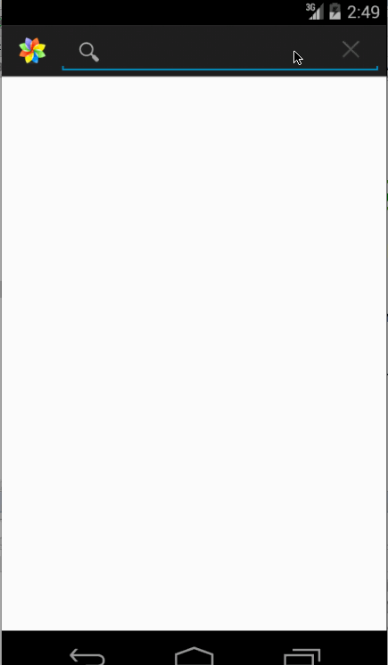

This is an Android application for Grid Image Search.

Time spent: 10 hours spent in total

Completed user stories:

 * [x] Required: User can enter a search query that will display a grid of image results from the Google Image API.
 * [x] Required: User can click on "settings" which allows selection of advanced search options to filter results
 * [x] Required: User can configure advanced search filters such as: Size, Color, Type, and Site.
 * [x] Required: Subsequent searches will have any filters applied to the search results
 * [x] Required: User can tap on any image in results to see the image full-screen
 * [x] Required: User can scroll down “infinitely” to continue loading more image results (up to 8 pages)

Advanced:
 * [x] check if internet is available (the checking is added in SearchActivity.doImageSearch(int offset))
 * [x] Use the ActionBar SearchView
 * [x] User can share an image 
 * [x] Implement DialogFragment for Filter Settings
 * [x] Add border to image in GridImageView
 * [x] Use the StaggeredGridView to display improve the grid of image results

GIF created with [LiceCap](http://www.cockos.com/licecap/).
