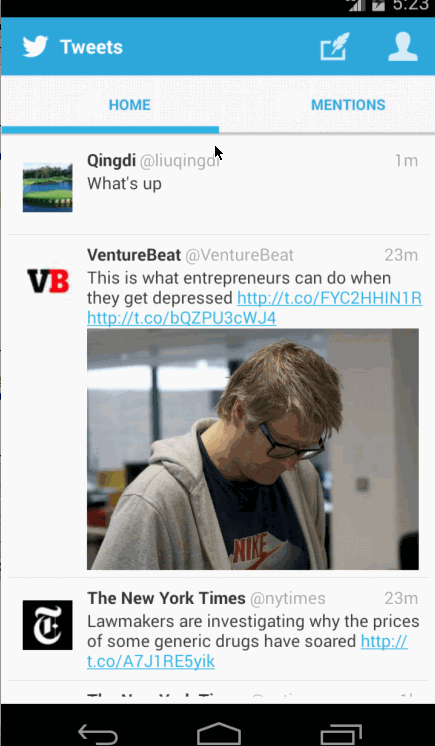
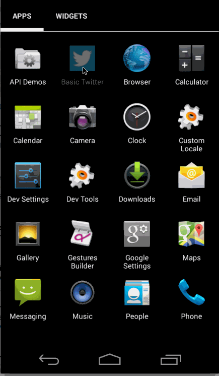

This is an Android application for Twitter Client.

Time spent: Wk4: 15 hours + Wk3: 10 hours

Completed user stories:

Wk4:
 * [x] Required: User can switch between Timeline and Mention views using tabs. 
 * [x] Required: User can navigate to view their own profile
 * [x] Required: User can click on the profile image in any tweet to see another user's profile. 

Wk3:
 * [x] Required: User can sign in to Twitter using OAuth login
 * [x] Required: User can view the tweets from their home timeline
 * [x] Required: User can compose a new tweet

Advanced:
 * [x] User can refresh tweets timeline by pulling down to refresh (i.e pull-to-refresh)
 * [x] Use ActiveAndroid to persiste tweets into sqlite 
 * [x] User can see embedded image media in tweet.
 * [x] Robust error handling, check if internet is available
 * [x] When a network request is sent, user sees an indeterminate progress indicator
 * [x] Improve the user interface and theme the app to feel "twitter branded"
 * [x] Compose activity is replaced with a modal overlay

GIF created with [LiceCap](http://www.cockos.com/licecap/).
